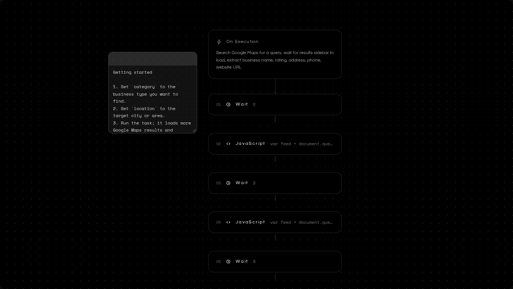

# Figranium Embed

Read-only Figranium task rendering inside a real iframe, with **no server and no hosted embed URL**.



The screenshot above is captured from the real zero-host iframe using the **Google Maps Leads Scraper** preset from Figranium Templates Hub.

`@figranium/embed` ships the iframe document inside the package. The package creates an iframe with `srcdoc`, loads Figranium's canonical read-only UI inside it, and passes task JSON through a small internal `postMessage` protocol.

## Install

```bash
npm install @figranium/embed
```

## Embed a task

```html
<div id="figranium-task"></div>

<script type="module">
  import { mountFigraniumEmbed } from '@figranium/embed';

  const embed = mountFigraniumEmbed('#figranium-task', {
    task,
    height: 600,
  });
</script>
```

That's it. There is no embed domain to configure, deploy, or keep online.

The returned controller can replace the rendered task or remove the iframe:

```js
embed.setTask(nextTask);
embed.destroy();
```

## What the iframe can do

It renders only what already exists in the task. It cannot edit blocks, open configuration modals, add or drag actions, save, run tasks, open the browser, use the selector picker, authenticate, or persist anything.

The iframe is sandboxed with scripts enabled and receives task data only from the page that created it.

## Why the UI stays in sync

This repository does **not** maintain a copied Figranium editor. Before each package build, it clones `figranium/figranium` and builds the iframe document from Figranium's canonical `src/embed` entrypoint and stylesheet.

Figranium exposes a purpose-built `ReadOnlyCanvas`, so Embed does not depend on the editor's internal prop surface. The compiled iframe document is then inlined into the npm package itself. CI rebuilds against current Figranium so incompatible upstream UI changes fail instead of silently drifting.

`FIGRANIUM_REF` can pin a build to a specific Figranium branch or tag; release builds default to `main`.

## React

React is optional and is not required for the primary iframe API. React apps that want a direct component instead of iframe isolation can use the secondary entrypoint:

```tsx
import { FigraniumEmbed } from '@figranium/embed/react';
import '@figranium/embed/style.css';

export function Preview({ task }) {
  return <FigraniumEmbed task={task} height={600} />;
}
```

## Development

```bash
npm install
npm run build
```

The build flow syncs current Figranium, compiles its read-only UI into a temporary standalone document, inlines that document into the package, deletes the temporary site output, then builds the public package.

## License

Apache-2.0
